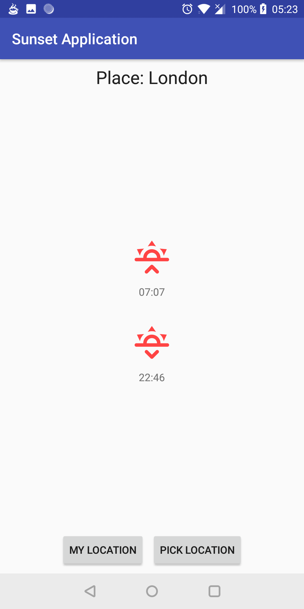

# SunsetApplication
This is simple application to check sunset and sunrise time via https://sunrise-sunset.org/.

Project is quite small, so no sophisticated architectures were used and the code is pretty straightforward.

## Built With
* [Android Studio](https://developer.android.com/studio/) should also work in other IDEs
* [Kotlin](https://kotlinlang.org/)
* [Gradle](https://gradle.org/)
* [Retrofit](https://square.github.io/retrofit/)
